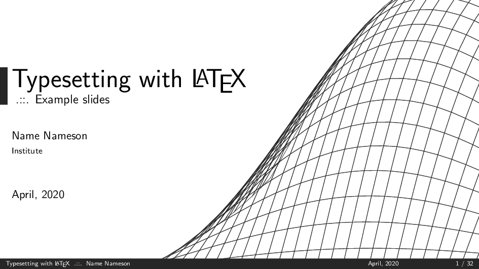
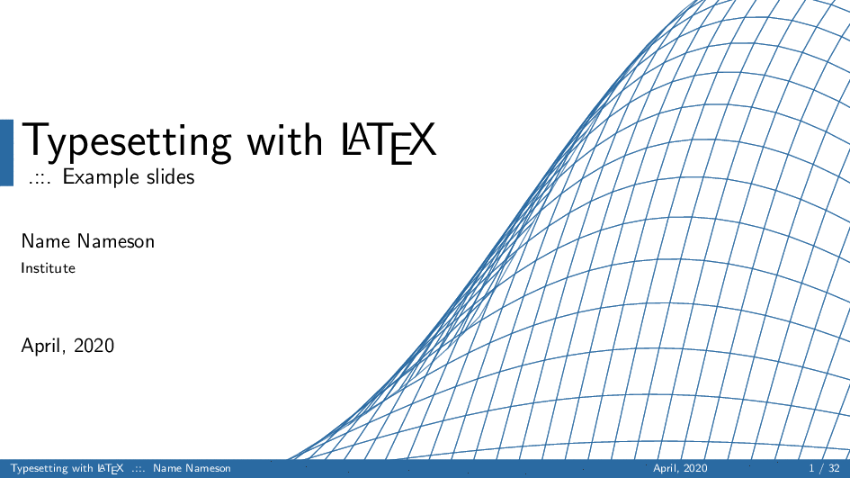
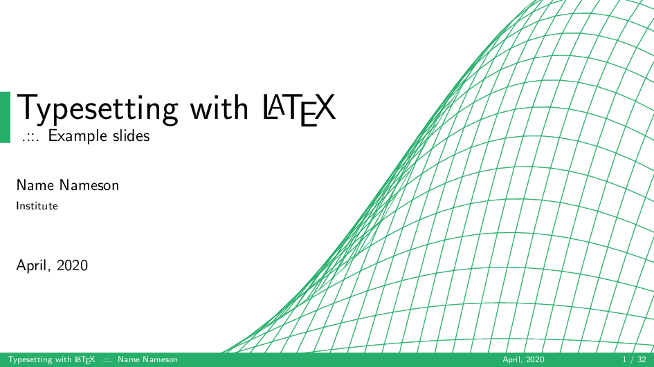
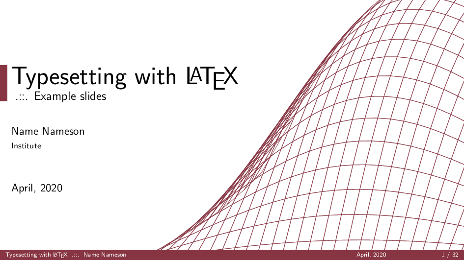

# NXYZ Beamer Theme

Just a simple and minimalistic beamer theme with a few custom elements created with the LaTeX packages PGFPlots and TikZ.

## Preview

### Black: `\usetheme[black]{NXYZ}`


### Blue: `\usetheme[blue]{NXYZ}`


### Green: `\usetheme[green]{NXYZ}`


### Red: `\usetheme[red]{NXYZ}`


## Usage 

Simply download the `.sty` files contained in this repository and include them in the preamble of the LaTeX beamer by specifying the theme as follows:

```
% Include this in the preamble of the LaTeX beamer
\usetheme[red]{NXYZ}     % Red theme 
% \usetheme[black]{NXYZ} % Black theme
% \usetheme[blue]{NXYZ}  % Blue theme
% \usetheme[green]{NXYZ} % Green theme
```

See the example document `main.tex` for reference and more details.

**Note**: The beamer document might have to be complied twice for the decorative mesh figure on the title page to be placed correctly. See commands below.

### Local Installation

Assuming you have a _local installation_ and have cloned the repository, the document `main.tex` can be compiled by running:

```bash
pdflatex main.tex && pdflatex main.tex
```

### Docker

Assuming you have _Docker_ installed and have cloned the repository, the document `main.tex` can be compiled by running:

```bash
docker build -t nxyz_beamer . && docker run --rm -v $(pwd):/data nxyz_beamer /bin/bash -c "pdflatex main.tex && pdflatex main.tex"
```
