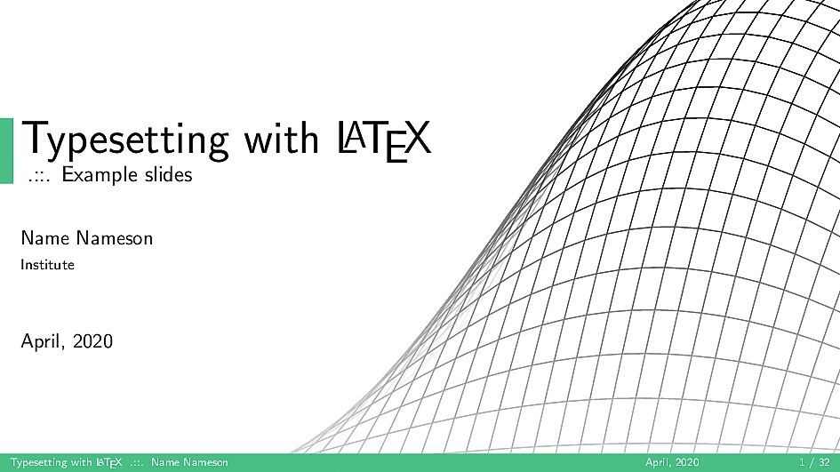

# NicklasXYZ Beamer Theme

Just a simple and minimalistic beamer theme with a few custom elements created with the LaTeX packages PGFPlots and TikZ.

## Preview



## Usage 

Simply download the `.sty` files contained in this repository and include them in the preamble of the LaTeX beamer, by specifying the theme as follows:

```
% Include this in the preamble of the LaTeX beamer
\usetheme{NicklasXYZ}
```

See the example document `main.tex` for reference and more details.

**Note**: The beamer document might have to be complied twice for the decorative mesh figure on the title page to be placed correctly.
